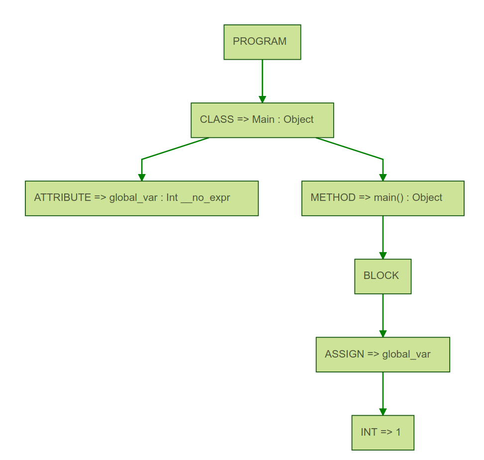

# COOL Compiler #
**Sections of interest in the COOL Manual**

* The grammar of COOL presented after the section 10 in the COOL Manual (refer to page number 16)

### Design/pipeline of the parser: ###
* __The Grammar__

	The Grammar provided in the COOL Manual was required for this assignment. 
	
* __Grammar Rules__

	The Grammar rules have to be split token by token to extract the textual information captured by every token. The ANTLR tool provided an API to help extract this information. In our code, we made use of these special functions which included `getLine()`, `getText()`. 
	
	Every grammar rule returns an AST Node, with some value. This value is determined by the token stream that occur on the right-hand-side of the grammar rule. For example: the node for a boolean constant i.e., `true` or `false` is given by `bool_const(<truth_value>, line_\number)`. The truth value and the line number is determined by examining the token content which is emitted by the lexer using the functions `getText()` and `getLine()`. 
	
	If a rule requires some variables to be used in the rules defined for a given node, then we use the `@init` section for declarations. We make use of it in a few places such as in `expression_list`, `branch_list` and `formal_list`, where we deem it necessary. These declarations help us modulate our code to make it look better and isolate errors if any in an easier manner.
	
* __Syntactical Correctness__

	Since we have made use of the exact same rules as mentioned in the COOL grammar for generating the AST, we believe and trust that our code is well-functional and correct.
	
	In the case of programs, if the given test code is syntactical correct, then the code written will print out a parse tree in the console. There will be no errors whatsoever. On the otherhand, if the given test code is syntactical incorrect, then the code written will print the first error detected with its line number. This may be used to evaluate the correctness of the parser/AST generator that we have written.

### Explanation Of Test Cases

* __test_1.cl__
 This test case is to visualize graphically the AST generated. 
 In the AST of any Cool Program the parent node is always <b>PROGRAM</b> .
 Since this program has only 1 class , PROGRAM has only child <b>CLASS MAIN</b>.
 In CLASS MAIN, 1 <b>ATTRIBUTE</b> "global_var" and 1 <b>METHOD</b> "main() : Object " is present. Hence the 2 child nodes of Class Main.
 In  method main() the <b>BLOCK</b> child has an <b>ASSIGN</b> operation in it , which assigns token <b>INT</b> to global_var.
 
 A graphical visualization is present below.

